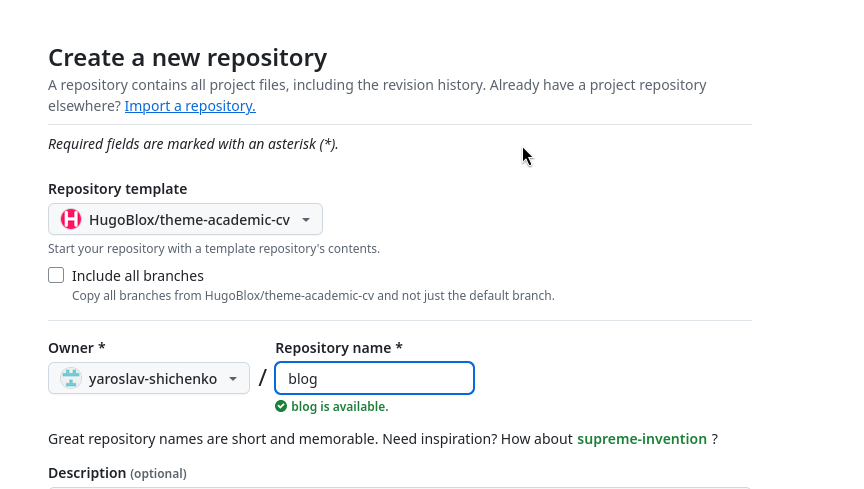
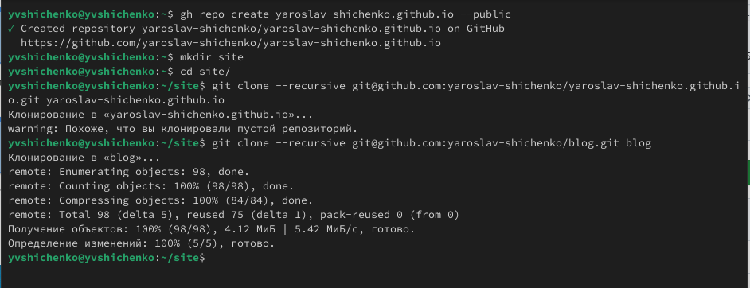
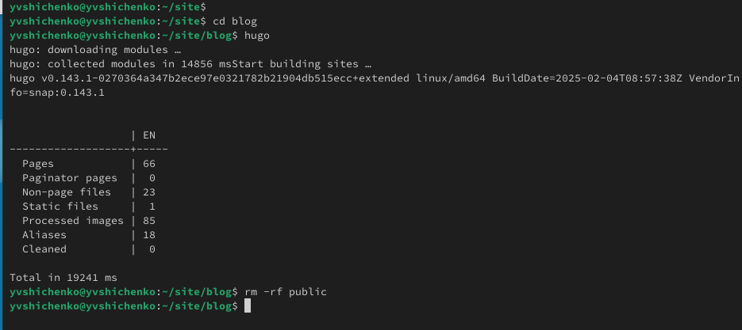
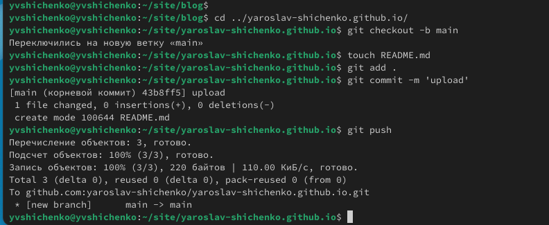
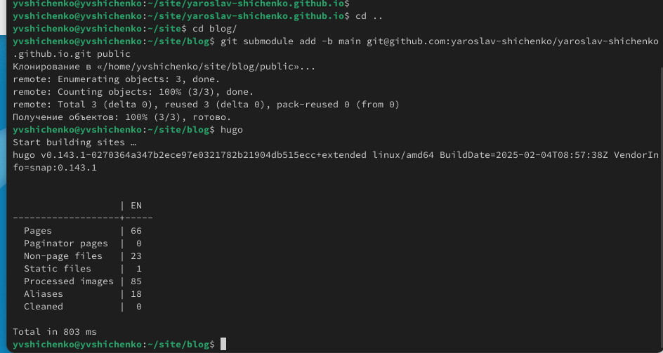
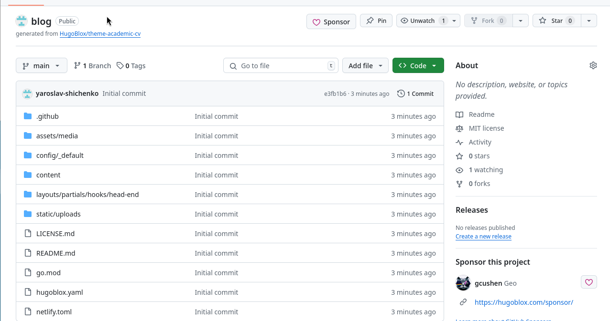

---
## Front matter
lang: ru-RU
title: Операционные системы
subtitle: Отчёт по 1 этапу проекта
author:
  - Ярослав Шищенко
institute:
  - Российский университет дружбы народов, Москва, Россия
date: 25 февраля 2025

## i18n babel
babel-lang: russian
babel-otherlangs: english

## Formatting pdf
toc: false
toc-title: Содержание
slide_level: 2
aspectratio: 169
section-titles: true
theme: metropolis
header-includes:
 - \metroset{progressbar=frametitle,sectionpage=progressbar,numbering=fraction}
---

# Цели и задачи

## Цель лабораторной работы

Подготовить репозиторий на основе шаблона. 

Ознакомиться с генератором сайтов hugo.

# Выполнение лабораторной работы

## Создание репозитория из шаблона

{ #fig:001 width=70% height=70%}

## Создание локальных репозиториев

{ #fig:002 width=70% height=70%}

## Инициализация hugo

{ #fig:003 width=70% height=70%}

## Подготовка репозитория

{ #fig:004 width=70% height=70%}

## Подготовка папки public

{ #fig:005 width=70% height=70%}

## Развертывание сайта

{ #fig:006 width=70% height=70%}

# Выводы

## Результаты выполнения лабораторной работы

Подготовили репозиторий и установили hugo.